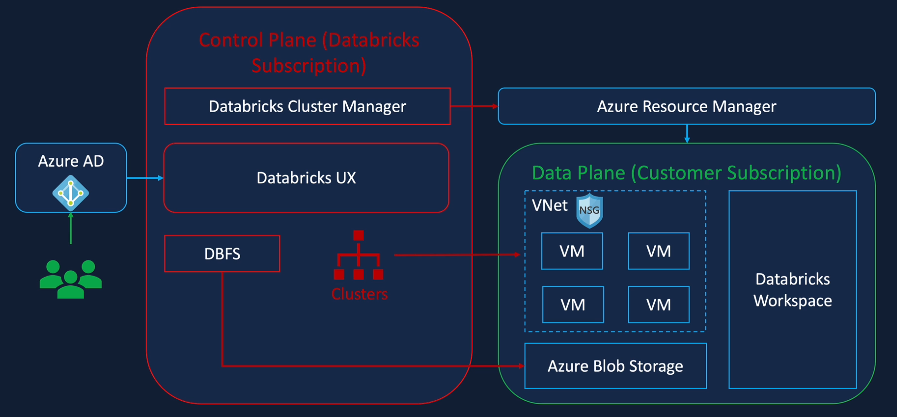

# Azure-Databricks

Real World Project on Formula1 Racing using Azure Databricks, Delta Lake, Unity Catalog, Azure Data Factory

## Azure Databricks Overview

### Apache Spark
- lightning fats unified analytics engine for big data processing and machine learning
- open source distributed compute engine Apache Spark
- simple and easy to use APIs compared to Hadoop for development and efficient for interactive and iterative computing jobs
- in-memory processing engine for large data processing
- distributed computing platform
- unified engine supports SQL, streaming, ML and graph processing  

### Apache Spark Architecture
- Spark Core
  - scheduling tasks, memory management, fault recovery, communication with storage systems, programming abstraction API
  - RDD - Resilient Distributed Datasets are a collection of items distributed across compute nodes in a cluster for parallel processing
- Spark SQL Engine
  - Catalyst optimizer - converts a computational query to a highly efficient execution plan
  - Tungsten - handles memory management and CPU efficiency
- Higher level APIs
  - Spark SQL
  - Spark streaming
  - Spark ML
  - Spark graph
  - DataFrame / Dataset APIs

### Databricks
- Clusters
- Workspace / Notebook
- Administration controls
- Optimized Spark (5x faster)
- Database / Tables
- Delta Lake (ACID transaction capability)
- SQL Analytics
- MLFLow

### Azure Databricks
- Unified Azure Portal and unified billing
- Azure Active Directory (Azure Security)
- Data Services connectors - Azure Data Lake, Blob storage, Cosmos DB, SQL Database, Synapse
- Managing Services - Azure IOT Hub / Event Hub
- Azure Data Factory
- Azure DevOps
- Power BI
- Azure ML

### Summary
- Azure Databricks is a Spark based unified data analytics platform as service offering that is optimized for Microsoft Azure Cloud

### Delta Live Tables
- Delta Live Tables (DLT) is a declarative ETL framework for the Databricks Data Intelligence Platform that helps data teams simplify streaming and batch ETL cost-effectively. Simply define the transformations to perform on your data and let DLT pipelines automatically manage task orchestration, cluster management, monitoring, data quality and error handling

### Azure Databricks Architecture 

- Data resides in Azure subscription (full control over data)
