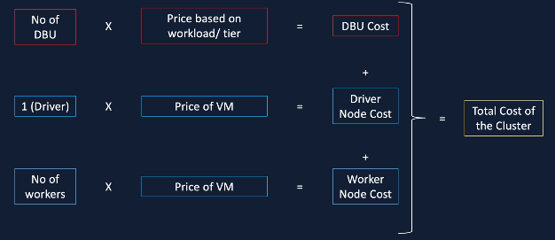
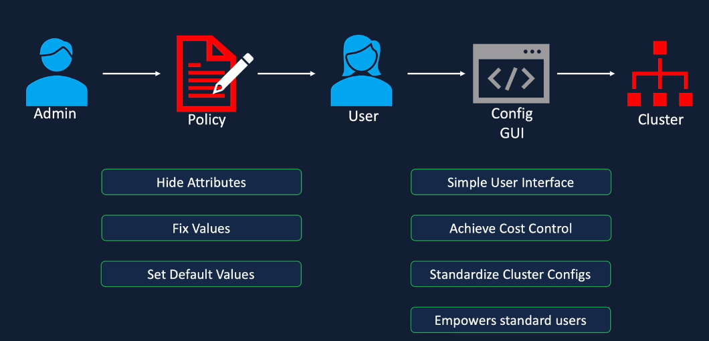

# Databricks Clusters

## Databricks Compute
- Databricks compute refers to the selection of computing resources you can provision in your Databricks workspace. Databricks compute includes all-purpose and job compute (also called clusters), instance pools, serverless SQL warehouses, and classic SQL warehouses

### Databricks Cluster
- collection of VMs with Driver node which orchestrates tasks to Worker nodes. Viewed as a single compute engine and enable running of ETL workloads

- Cluster types:
  - All purpose - create manually, persistent, suitable for interactive workloads, shared among many users, expensive to run
  - Job cluster - created by Jobs, Terminated at end of job, suitable for automated workloads, isolated just for the job, cheaper to run, job are created via workflows and creating a new job allows new job cluster
  - Pools - Databricks pools are a set of idle, ready-to-use instances. When cluster nodes are created using the idle instances, cluster start and auto-scaling times are reduced
  - Policy - tool workspace admins can use to limit a user or group’s compute creation permissions based on a set of policy rules.
- All purpose clusters are used for interactive analysis workloads whereas job clusters are used for repeated production workloads

### Cluster configuration
- Single / Multi Node
  - A single node compute is a computing resource consisting of an Apache Spark driver and no Spark workers. Single node compute support Spark jobs and all Spark data sources, including Delta Lake. Used for single-node machine learning workloads that use Spark to load and save data and lightweight exploratory data analysis. Not horizontally scalable and not suitable for large ETL workloads
  - Multi Node clusters are for larger jobs with distributed workloads. Driver node distributes tasks to run on one or more worker nodes in parallel. Scaling dependent on workloads by adding worker nodes
- Access Mode
  - Single User - only one user access, supports python, sql, scala, R
  - Shared - multiple user access, premium, supports python, sql, provides process isolation meaning one process cannot view data or credential use by another process
  - No isolation shared - multiple user access, supports python, sql, scala, R, does not provide process isolation meaning failure in one process may affect another and does not offer task pre-emption meaning one running process can use all resources and others may fail, less secure
  - Custom - legacy configurations
- Databricks Runtime
  - Databricks Runtime
  - Databrikcs Runtime ML
  - Photon Runtime
  - Databricks Runtime Light
- Auto Termination
  - Terminates the cluster after x minutes of inactivity
  - Default value for Single node and Standard clusters is 120 minutes
  - Users can specify a value between 10 and 10000 mins as the duration
- Auto Scaling
  - User specifies the min and max work nodes
  - Auto scales between min and max based on the workload for changing workloads or if unknown workload upfront  
  - Not recommended for streaming workloads
- Cluster VM Type / Size
  - Memory Optimized - memory intensive applications such as ML workload that caches data in memory
  - Compute Optimized - structured streaming applications for ensuring processing rate is above input rate at peak times - used for distributed analytics and data science applications
  - Storage Optimized - high disk throughput and I/O use cases
  - General Purpose - enterprise grade applications and analytics with in-memory caching
  - GPU Accelerated - deep learning models that are data and compute intensive
- Cluster Policy
  - responsibility of Data Administrator and only available on premium
  - workspace admins can use to limit a user or group’s compute creation permissions based on a set of policy rules
  - limit users to creating clusters with prescribed settings
  - limit users to creating a certain number of cluster
  - simplify the user interface and enable more users to create their own clusters (by fixing and hiding some values)
  - control cost by limiting per cluster maximum cost (by setting limits on attributes whose values contribute to hourly price)
  - enforce cluster-scoped library installations
  - example: personal compute policy can be assigned to users or groups so user can only create single node clusters, default runtime version to ML Runtime, limited node types, and auto termination set to 20 mins. Assign to ML Engineers

### Create Databrick cluster
- policy
- access mode
- runtime version and node type
- Photon acceleration and terminate after x mins of inactivity
- Tags
- Advanced options
  - Spark config and env variables
  - Logging to DBFS log path
  - Init Scripts to install python packages on cluster start up so all developers have the same environment to work on
- Cluster running
  - Edit configurations (requires restart of cluster)
  - Notebooks can be attached or detached
  - Install libraries and provide file path or Maven coordinates
  - Event log for cluster and error messages and coordinates
  - Spark UI
  - Driver logs
  - Metrics for performance monitoring
  - Apps

Config notes
- Cluster Type - Single Node
- Node Type - Standard_D4a_v4

### Databricks Cluster Pricing
- Workload - all purpose, jobs, SQL, Python
- Tier - premium or standard
- VM type - general purpose, GPU, Optimized
- Purchase plan - pay as you go / pre-purchase
- DBU - normalized units of processing (per hour)
- Use Azure Databricks pricing options calculator
- Azure Cost analysis and management, budgets, and cost alerts
- Pricing Calculation:

### Azure Databricks Cluster Pool
- Databricks pools are a set of idle, ready-to-use instances. When cluster nodes are created using the idle instances, cluster start and auto-scaling times are reduced. If the pool has no idle instances, the pool expands by allocating a new instance from the instance provider in order to accommodate the cluster’s request. When a cluster releases an instance, it returns to the pool and is free for another cluster to use. Only clusters attached to a pool can use that pool’s idle instances.
- Reduce times to provision a cluster and cluster pools always have one node idle which incurs charge

### Cluster Policy

- Create Compute policy
- Custom policy - define a policy in code using JSON objects
- Hide attributes and limit what user can view on cluster creation UI
- Able to edit and Override JSON objects of existing policies to create a custom policy that is similar to the Personal Compute for example
