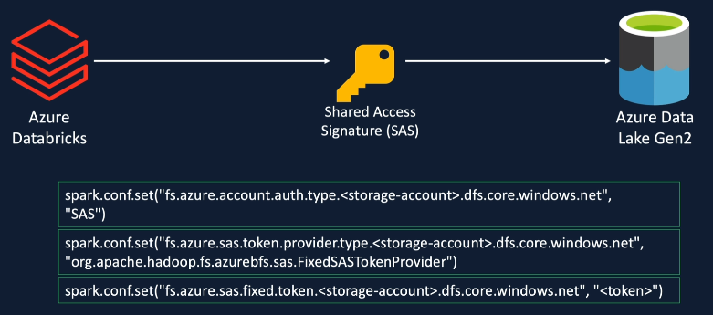

# Accessing Azure Data Lake from Databricks

## Access Azure Data Lake Storage Gen2
- Azure storage account has access key that is used to access the storage account
- Can generate a Shared Access Signature (SAS Token) to access the storage account (more granular level)
- Create Service Principle and give required access for the data lake to the Service Principle and use credentials to access the storage account
- Two forms:
  - Session Scoped Authentication - use credentials in notebook to authenticate to the data lake, authentication valid for duration of session until notebook detached to cluster
  - Cluster Scoped Authentication - use credentials in cluster and authenticate when cluster starts and valid until cluster terminated, all notebooks connected to cluster have access to the data
- Access Patterns:
- AAD Passthrough Authentication - enable cluster to use Azure Active Directory Passthrough Authentication. User runs a notebook and cluster uses AAD credentials and roles assigned to the Azure data lake storage using IAM
- Unity Catalog - admin can define the access permissions. User access the storage account, cluster checks for user access in the Unity Catalog

## Create Azure Data Lake Storage Gen2
- Hierarchical namespace, complemented by Data Lake Storage Gen2 endpoint, enables file and directory semantics, accelerates big data analytics workloads, and enables access control lists (ACLs)
- enable soft deletes
- create containers
- Set up Azure Storage Explorer

## 1. Access Azure Data Lake Gen2 using Access Keys
- Each storage account comes with 2 512 bit storage account access keys
- Gives full Access to the storage account
- Secure keys in Azure Key Vault
- Keys can be rotated (regenerated) if compromised, 2 keys help achieve uninterrupted access to services

### Access Keys - Spark Configuration
- provide one access keys to Azure Databricks to authenticate to the ADLS Gen2 Service by assigning access key to a Spark configuration called fs_azure.account.key

### Access Keys - abfs driver
- use abfs (Azure Blob File System) driver to access data store in a storage account from Databricks
  - optimized for big data analytics
  - offers better security
  - part of Apache Hadoop suite of products
- URI scheme to access files in ADLS Gen2 using the abfs driver
  -  abfs[s] - s ensures TLS transport layer security, data encrypted while in transit
  - container
  - storage account endpoint

  

  

- In storage account gen2 dl, show access keys (2 access keys can be rotated)
- successfully used the access key to authenticate to ADLS storage account and list files and read data
- Using access keys gives full access to the storage account and is not suitable as it is best practice to restrict access and provide only the required access for users such as Read Access for a limited period of time

## 2. Access Azure Data Lake Gen2 using Shared Access Signature (SAS Token)
- Provides fine grained access to the storage
- Restrict access to specific resource types / services such as blob containers and restrict access to files, queues, tables
- Allow specific permissions such as read only access
- Restrict access to specific time period
- Limit access to specific IP addresses
- Recommended access spatters for external clients
- Types of shared access signatures:
  - User delegation SAS - secured with Microsoft Entra credentials and applies to blob storage only
  - Service SAS - secured with the storage account key and delegates access to a resource in only one of Blob storage, Queue storage, Table storage, or Azure files
  - Account SAS - secured with the storage account key. An account SAS delegates access to resources in one or more of the storage services

- generate SAS token in specific container in Azure portal so users have access to the container specified, and assign SAS token to key, set permissions and start and expiry, set allowed IP addresses and protocols
- Copy and use Blob SAS token
- successfully used SAS to authenticate to ADLS storage account and list files and read data
- In Azure Storage Explorer, get shared access signature and generate a SAS token

## 3. Access Azure Data Lake Gen2 using Service Principal
- An Azure service principal is an identity created for use with applications, hosted services, and automated tools such as Databricks jobs and CI/CD pipelines to access Azure resources. This access is restricted by the roles assigned to the service principal, giving you control
- Service principles provide better security and traceability

- Micorosft Entra ID Default Directory, new app registration (service principal) to obtain Application (client) ID and Directory (tenant) ID
- create certificates and secrets to obtain value
- assign role 'Storage Blob Data Contributor' to Service principal to access the data lake
- successfully used IAM to add role assignment to service principal so service principal can access data lake storage account from Databricks and list files and read data

## Session Scoped Authentication (previous access methods)

- set spark configuration parameters with secrets in notebook
- executed notebooks on cluster which uses secrets to authenticate to ADLS Gen2 and returned results / data requested
- Valid only in the session executed by the notebook and detaching notebook requires re-authentication

## Cluster Scoped Authentication

- set spark configuration parameters and secret values within cluster creation
- every notebook which runs on cluster has authentication to the ADLS which means cluster cannot be used for other purposes and cannot restrict access to specific users
- cluster is specific to one permission group where all users have same level of access
- not widely used in industry

## 4. Access Azure Data Lake Gen2 using Cluster Scoped Credentials
- Edit cluster using advanced options
- Set Spark config with fs azure account and secret value
- Attach cluster to notebook
- Successfully execute list and read files on cluster as access key is stored within the cluster and authenticated to the ADLS Gen2
- Never hard code secrets or store them in plain text. Use the Secrets API 2.0 to manage secrets in the Databricks CLI. Use the Secrets utility (dbutils.secrets) to reference secrets in notebooks and jobs

## 5. Access Azure Data Lake Gen2 using ADD Credential Passthrough
- Azure Databricks passes AAD Azure Active Directory credentials to the ADLS Gen2 storage account to authenticate
- if user has required role assigned in RBAC Azure role-based access control, then user can access storage account
- useful for multiple ML Engineers using the same cluster but each access only specific storage accounts
- Enable credential passthrough for user-level data access (requires single user or shared access mode)
- Add Storage Blob Data Contributor role assignment for user that requires access in data lake in Azure portal IAM and select member as user
- Successfully executed notebook to read data from ADLS container via authentication through AAD Credential Passthrough
