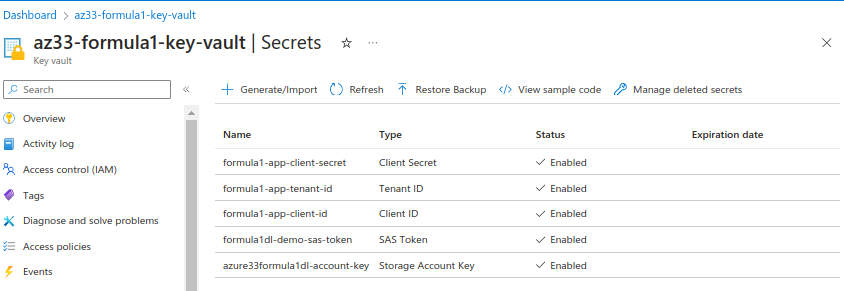

# Securing Access to Azure Data Lake

## Securing Secrets
- Azure Key Vault
- Databricks Secret Scope
  - secret scopes help store the credential securely and reference them in notebooks, clusters, and jobs when required
  - Types
    - Databricks backed Secret Scope
    - Azure Key-vault backed Secret Scope (recommended when using Azure)

### Creating Azure Key vault
- create key vault with vault access policy
  - A Key Vault access policy determines whether a given security principal, namely a user, application or user group, can perform different operations on keys, secrets and certificates
- Generate a secret for data lake storage account key

### Creating Secret Scope
- Managing secrets begins with creating a secret scope. A secret scope is collection of secrets identified by a name
- Access secret scope from Databricks Homepage using #secrets/createScope at end of URL
- create secret scope and link to Azure Key Vault using DNS name (Vault URI in Azure) and Resource ID

### Databricks Secrets Utility
- dbutils.secrets utility offers several methods
- list secret scopes
- list secrets list within our scope
- get values of the secrets with scope and key (Redacted and avoids hard coding or compromising secrets - useful for Git)
- Security:
  - Secret scopes avoids keeping secrets in plain text and revealing them to someone outside of the organisation
  - Everyone who has access to the Databricks workspace can access secret scope, therefore must manage users who are added to the workspace, restrict access to the secrets to certain users by restricting access to the Key Vault using the RBAC roles within the Key Vault

## Using Secrets to Access Azure Data Lake using Notebooks

### Access key method
- use dbutils.secrets.get to obtain secret from the scope and account key which returns the secret value
- assign this to a new variable
- execute spark configuration using variable instead of hard code account key
- successfully execute list and read file - secrets from secret scope and key vault has been used to access the storage account without hard coding key values

### SAS token method
- In Azure key vault, generate secret for SAS Token and store SAS secret value
- Invoke get method from Databricks secret utility and assign SAS value to a variable
- Replace variable with hard coded SAS value in the Spark configuration
- successfully execute list and read file

### Service Principle method
- In Azure key vault, generate secret for client_id, tenant_id, and client_secret
- Use get method of the Databricks secret utility to get the values from key vault
- Assign secrets to variables and execute spark configuration
- successfully execute list and read file

### Implement Secrets Utility in Databricks Clusters method
- In Databricks, Compute, Edit Cluster Configuration
- Advanced options and edit the Spark config
- Spark configuration is a name value pair
  - the account key is fs.azure.account.key.formula1dl.dfs.core.windows.net
  - the value is provided using the value from the key vault by accessing the secrets utility using {{secrets/formula1-scope/formula1dl-account-key}}
- confirm and restart cluster
- Successfully access the data without providing Spark configurations or access keys within the notebook as it is defined in the Cluster Spark config on start up
