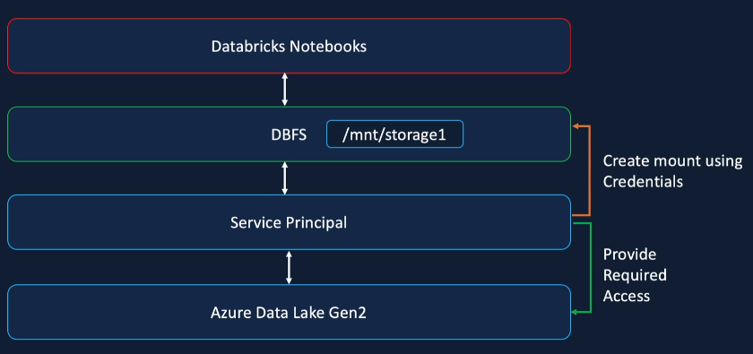
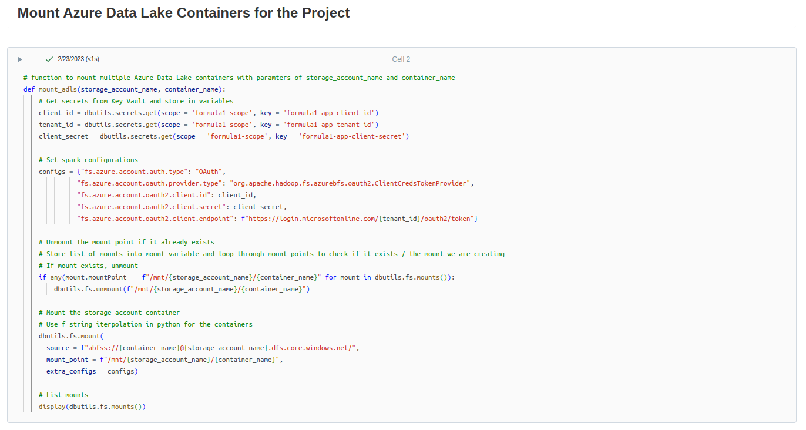
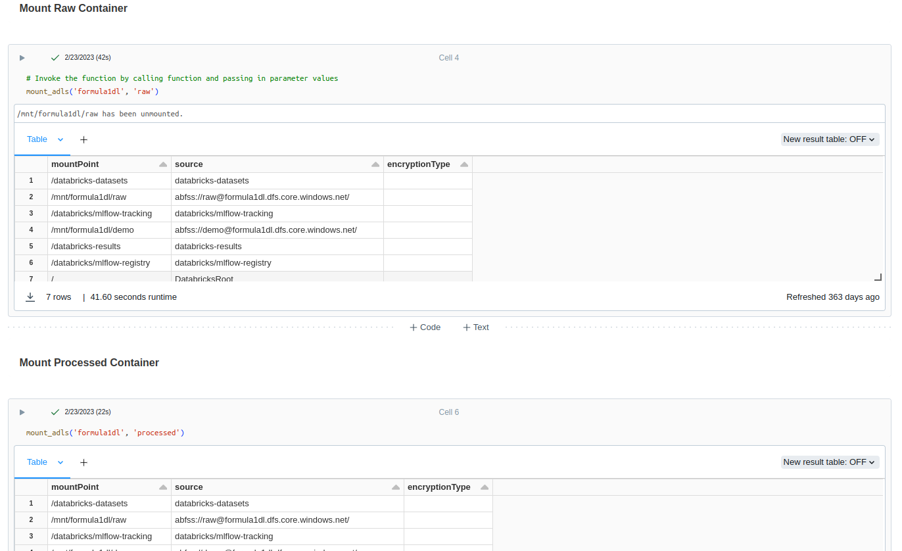

# Mounting Data Lake Container to Databricks

## Databricks Mounts
- Databricks enables users to mount cloud object storage to the Databricks File System (DBFS) to simplify data access patterns for users that are unfamiliar with cloud concepts. Mounted data does not work with Unity Catalog, and Databricks recommends migrating away from using mounts and managing data governance with Unity Catalog.

- Databricks mounts create a link between a workspace and cloud object storage, which enables you to interact with cloud object storage using familiar file paths relative to the Databricks file system

## Databricks File System (DBFS)
- a distributed file system mounted on the Databricks workspace
- DBFS Root is the default storage for a Databricks workspace created during workspace deployment
- Databricks recommends against storing production data in this location as FileStore is accessible to all users in the workspace
- Used for quick analysis on small volume data that does not require authentication, and for markdown purposes for images and charts

## Explore DBFS Root
- use file system utilities to obtain directories from DBFS Root
- Enable DBFS file browser in admin setings
- use catalog to uplaod file to DBFS root using UI
- list data within the FileStore and read csv file contents

## Databricks Mounts Benefits
- Once Azure object storage solution such as Azure Data Lake or Azure Blob Storage is mounted to the Databricks workspace, access data without requiring credentials
- Access files using file semantics rather than storage URLs using /mnt/storage1 for example
- Only an abstraction layer as it stores flies to object storage such as Azure Blob so get all the benefits from Azure such as performance tiers, replication, storage

## Mount ADLS using Service Principle
- In order to create a mount from Azure Data Lake Gen2 to DBFS, a Service Principal is required (which is an Azure Active Directory AAD credential considered as a Service Account)
- Grant Access to the ADLS to the Service Principal
- Create mount points in DBFS using these credentials
- The mount points provide access to storage without requiring credentials to access the data and enables use of file system semantics

## Python Code
- get client id, tenant id, and client secret from key vault
- configs dictionary to set spark config
- call file system utility mount to mount the storage, specify source, mount_point (name) and extra configs which is the spark config dictionary
- Mounting allows use of the file system semantics such as /mnt/formula1dl/demo instead of abfs protocol url
- use the mount point to access data from the storage without specifying credentials or spark configurations

### Mounting Azure Data Lake Storage Gen2
- configs and use dbutils file system utility mount to mount the storage
  - source - URL to the container using the abfs protocol
  - mount_point - naming standard is to use storage account and container
  - extra_configs - spark configs in the python dictionary
- read files using mount file system semantics
- list all mounts
- unmount a mount point if required

### Mounting all Azure Data Lake Storage Gen2 containers to Databricks by creating a reusable python function

Mount Function

Invoke Mount for multiple containers

