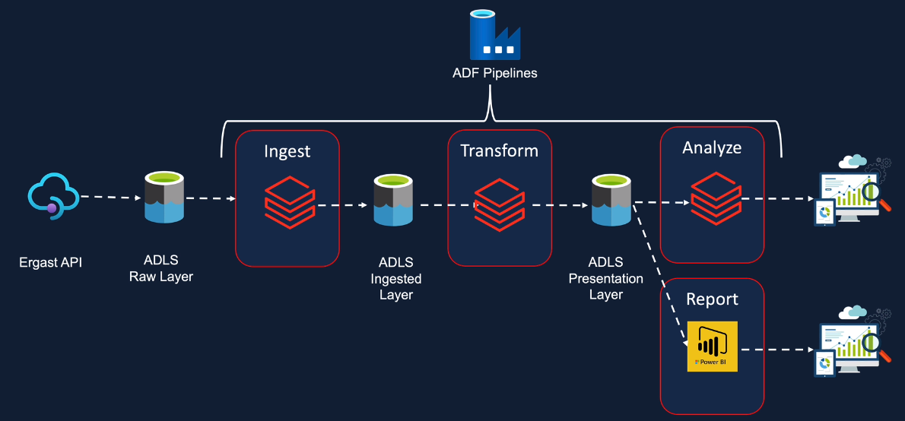
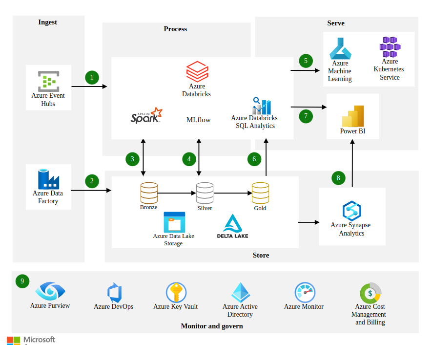
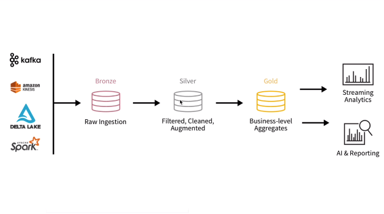

# Project Overview

## Data Sources
- Ergast Developer API - CSV  Database Tables
- Data Files
  - Circuits CSV
  - Races CSV
  - Constructors Single Line JSON
  - Drivers Single Line Nested JSON
  - PitStops Multi Line JSON
  - LapTimes Split CSV Files
  - Qualifying Split Multi Line JSON Files

### Entity Relationship Diagram

## Import Raw Data to Data Lake
- upload raw data using Azure Storage Account

### Project Ingestion Requirements
- Ingest 8 files into the data lake
- Ingested data must have the schema applied
- Ingested data must have audit columns
- Ingested data must be stored in columnar format - Parquet
- Must be able to analyse the ingested data via SQL
- Ingestion logic must be able to handle incremental load - data received for one race should be appended rather than replacing all data in the data lake

### Project Transformation Requirements
- Join the key information required for reporting to create a new table
- Join the key information required for Analysis to create a new table
- Transformed tables must have audit columns
- Must be able to analyse the transformed data via SQL
- Transformed data must be stored in columnar format - Parquet
- Transformation logic must be able to handle incremental load

### Reporting Requirements
- Driver Standings
- Constructor Standings

### Analysis Requirements
- Dominant Drivers
- Dominant Teams
- Visualise the outputs
- Databricks Dashboard

### Scheduling Requirements
- Pipelines scheduled to run every Sunday 10pm
- Monitor pipelines
- Re-run failed pipelines
- Alerts on failures

### Non-Functional Requirements
- Ability to delete individual records for user privacy and GDPR
- Ability to see history and time travel
- Ability to roll back to a previous version

## Solution Architecture

## Modern analytics architecture with Azure Databricks from Microsoft

## Databricks Architecture

- bronze - raw layer
- silver - processed / ingested data layer
- gold - presentation layer
- Bronze to Gold means data quality improves and business value of the data increases
- use Azure Architecture Center to design and architect better data solutions
