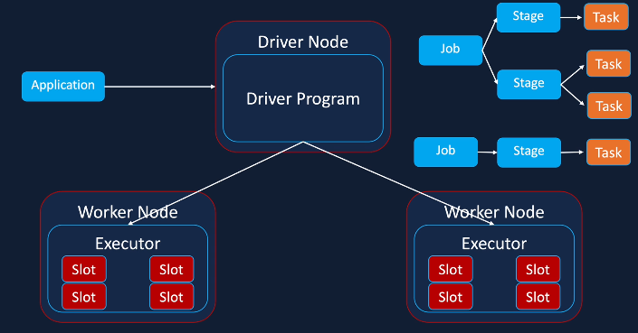

# Spark

## Spark Architecture

- Databricks cluster has a driver nodes with one or more Worker nodes
- Nodes are VMs on virtual cloud and usually have 4 or more cores
- Driver runs driver program on the Java Virtual Machine JVM in the driver node and creates the spark context - responsible for driving processing not performing computations, communicates with cluster manager to allocate resources and identifies jobs, stages, and tasks to be created so work can be parallelised
- Workers run Executor JVMs - optimal for one Executor per worker node - responsible for data processing, read / write data to external data sources, each executor has one or more Slots to execute task (usually 4 slots if there are 4 cores on the worker node)
- Slots are used to execute tasks received from the Driver Program.
- Driver node runs the application, for instance running commands in Databricks notebook or when Spark submit outside of Databricks is run
  - Application is divided into Jobs, Stages and Tasks by Driver Program
  - Spark optimises parallelism based on how data is partitioned and distributed across the cluster and depends on the Stages that can be parallelised
  - Tasks are low level components that are executed
  - Driver assigns Tasks to a slot where they are executed / operations performed in the Executor Worker node, and the result is returned to the Driver, which is then returned to the User
- 2 methods of Scaling Clusters
  -  Vertical Scaling: Increases the number of cores in the Executor in the Worker nodes - increasing from 4 cores to 6 cores - Limit is the maximum number of cores available on a VM
  - Horizontal Scaling: Add more Worker Nodes which contain Cores - Allows scaling of clusters that process petabytes of data for big data processing

  

## Spark DataFrame
- A DataFrame is a two-dimensional labelled data structure with columns of potentially different types
- The Apache Spark DataFrame API provides a rich set of functions (select columns, filter, join, aggregate, and so on) that allow you to solve common data analysis problems efficiently. DataFrames also allow you to intermix operations seamlessly with custom Python, R, Scala, and SQL code
- Data Sources API and Data Sources API
- Dataframe is divided into logical partitions that are executed by different executors / slots, which allows parallel execution and fast results

