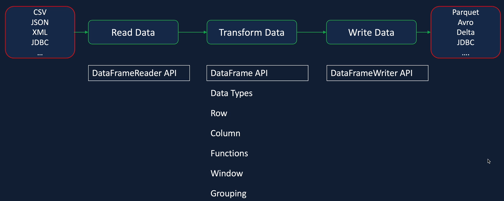

# Data Ingestion

## Data Ingestion - CSV

https://spark.apache.org/docs/latest/api/python/reference/index.html

https://spark.apache.org/docs/latest/api/python/index.html

### Data Ingestion Requirements
- Ingest 8 files into the data lake
- Ingested data must have the schema applied
- Ingested data must have audit columns
- Ingested data must be stored in columnar format - Parquet
- Must be able to analyse the ingested data via SQL
- Ingestion logic must be able to handle incremental load - data received for one race should be appended rather than replacing all data in the data lake

### ETL Data Processing

- In ETL Data processing, input data can be in files of various formats such as tables and real time streams
- Ingestion process reads data, transforms data including applying schema and fixing data quality, aggregations, and then writes data into output storage such as file store, databases, or streams
- Spark provides a DataFrameReader API,  DataFrame APIs to transform data, and a DataFrameWriter API to write data to output sources in a range of file formats

### Ingest Circuits File
- Read the CSV file using the spark Dataframe Reader
- Specify Schema for the data
- Select only he required columns
- Rename columns
- Add ingestion date to the dataframe
- write data to data lake as parquet

